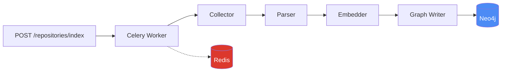
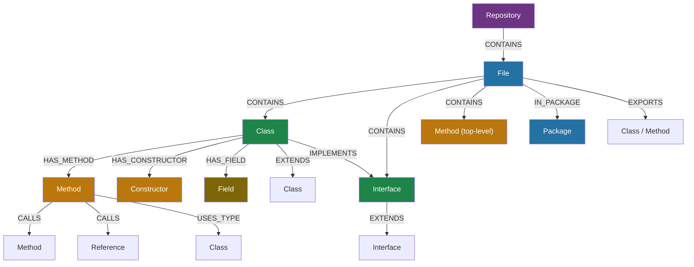
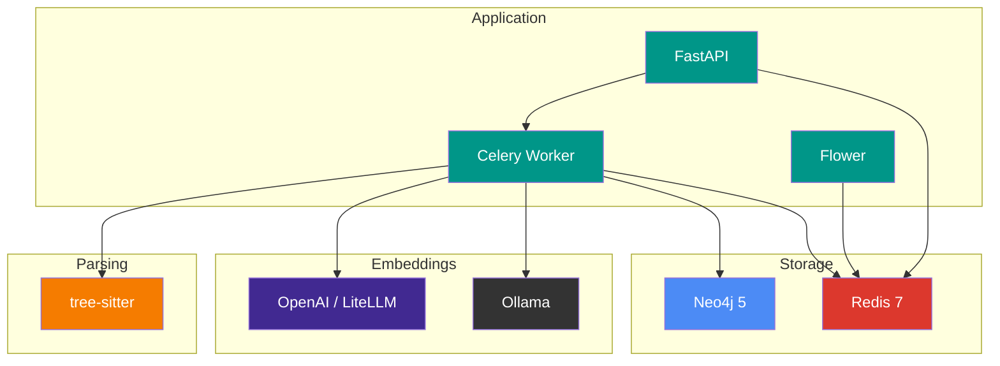

# Constellation

A code indexing engine that parses source code, generates vector embeddings, and builds a semantic knowledge graph in Neo4j. Feed it any repository — local or remote — and it extracts classes, methods, fields, relationships, and package structures into a queryable graph with vector search support.

Constellation is a standalone data layer. A separate service (such as [Telescope](https://github.com/sriramdingari/Telescope), an MCP server) can query the graph for code search, impact analysis, and navigation.

## Architecture



| Stage | What it does |
|-------|-------------|
| **Collector** | Discovers source files, filters by extension and exclusion patterns, computes MD5 hashes for change detection |
| **Parser** | Extracts entities (classes, methods, fields, constructors, interfaces) and relationships (calls, inheritance, implementations) using tree-sitter |
| **Embedder** | Generates vector embeddings for semantic search on methods, classes, interfaces, and constructors |
| **Graph Writer** | Batch upserts entities and relationships into Neo4j using MERGE queries |

## Table of Contents

- [Installation](#installation)
- [Quick Start](#quick-start)
- [Usage](#usage)
- [API Reference](#api-reference)
- [Configuration](#configuration)
- [Monitoring](#monitoring)
- [Graph Schema](#graph-schema)
- [Language Support](#language-support)
- [Development](#development)
- [Project Structure](#project-structure)
- [Troubleshooting](#troubleshooting)

## Installation

### Prerequisites

- **Docker and Docker Compose** (recommended) — runs everything with one command
- **Python 3.12+** — only needed for local development
- An **OpenAI API key** or a running **Ollama** instance for embeddings
- Optionally, a **LiteLLM** proxy if you want to route embeddings through a unified gateway

### Option 1: Docker (Recommended)

```bash
git clone https://github.com/sriramdingari/Constellation.git
cd Constellation
cp .env.example .env
```

Edit `.env` and set your embedding provider credentials:

```bash
# For OpenAI (default)
OPENAI_API_KEY=sk-your-key-here

# For LiteLLM proxy
OPENAI_API_KEY=sk-your-litellm-key
OPENAI_BASE_URL=http://localhost:4000

# For Ollama (no API key needed; defaults to nomic-embed-text / 768 dims)
EMBEDDING_PROVIDER=ollama
OLLAMA_BASE_URL=http://host.docker.internal:11434

# Optional Ollama overrides
# OLLAMA_EMBEDDING_MODEL=mxbai-embed-large
# OLLAMA_EMBEDDING_DIMENSIONS=1024
```

> **Docker networking note:** When running in Docker, use service names for Neo4j and Redis:
> ```bash
> NEO4J_URI=bolt://neo4j:7687
> REDIS_URL=redis://redis:6379
> ```
> The defaults in `.env.example` use `localhost`, which works for local development but not inside containers.

Start all services:

```bash
docker compose up
```

This starts five services:

| Service | Port | Purpose |
|---------|------|---------|
| `constellation-api` | 8000 | REST API |
| `constellation-worker` | — | Celery background worker |
| `flower` | 5555 | Celery task monitoring dashboard |
| `neo4j` | 7474 (browser), 7687 (bolt) | Graph database |
| `redis` | 6379 | Message broker and job state |

Verify everything is running:

```bash
curl http://localhost:8000/health
# {"status":"ok","neo4j":"connected","redis":"connected"}
```

### Option 2: Local Development

```bash
git clone https://github.com/sriramdingari/Constellation.git
cd Constellation

python -m venv .venv
source .venv/bin/activate
pip install -r requirements.txt
```

Start Neo4j and Redis (via Docker or installed locally):

```bash
docker compose up -d neo4j redis
```

Run the API server:

```bash
uvicorn constellation.main:app --host 0.0.0.0 --port 8000
```

Run the Celery worker (in a separate terminal):

```bash
source .venv/bin/activate
celery -A constellation.worker.celery_app worker --loglevel=info
```

## Quick Start

Once the services are running, index a repository with a single curl:

```bash
# Index a local codebase
curl -X POST http://localhost:8000/repositories/index \
  -H "Content-Type: application/json" \
  -d '{"source": "/path/to/your/repo"}'

# Index a public GitHub repository
curl -X POST http://localhost:8000/repositories/index \
  -H "Content-Type: application/json" \
  -d '{"source": "https://github.com/user/repo"}'
```

Response:

```json
{
  "job_id": "abc123-def456",
  "repository": "repo"
}
```

Track indexing progress:

```bash
curl http://localhost:8000/jobs/abc123-def456
```

```json
{
  "job_id": "abc123-def456",
  "status": "in_progress",
  "progress": {
    "files_total": 42,
    "files_processed": 18,
    "entities_found": 156
  }
}
```

Once completed, browse the graph in the Neo4j browser at `http://localhost:7474`.

## Usage

### Indexing a Repository

```bash
curl -X POST http://localhost:8000/repositories/index \
  -H "Content-Type: application/json" \
  -d '{
    "source": "/path/to/repo",
    "name": "my-project",
    "exclude_patterns": ["**/generated/**"],
    "reindex": false
  }'
```

| Field | Required | Description |
|-------|----------|-------------|
| `source` | Yes | Local filesystem path or public GitHub URL |
| `name` | No | Repository name in the graph. Derived from `source` if omitted |
| `exclude_patterns` | No | Additional glob patterns to skip. Merged with built-in defaults (`node_modules`, `venv`, `__pycache__`, `.git`, `build`, `dist`, etc.) |
| `reindex` | No | Set to `true` to bypass change detection and reprocess all files |

**Local paths in Docker:** If running in Docker and indexing local paths, you need to bind-mount the directory into the container. Add this to `docker-compose.yml` under both `constellation-api` and `constellation-worker`:

```yaml
volumes:
  - repos:/app/repos
  - /path/to/your/code:/code:ro  # Mount your code directory
```

Then use `/code` as the source path in the API call.

**GitHub URLs:** Public repos are shallow-cloned, indexed, and automatically cleaned up. Private repositories are not currently supported.

### Listing Repositories

```bash
curl http://localhost:8000/repositories
```

```json
[
  {
    "name": "my-project",
    "file_count": 42,
    "entity_count": 356,
    "indexed_at": "2025-01-15T10:30:00"
  }
]
```

### Getting Repository Details

```bash
curl http://localhost:8000/repositories/my-project
```

### Deleting a Repository

Removes the repository and all its indexed data (files, entities, relationships) from the graph.

```bash
curl -X DELETE http://localhost:8000/repositories/my-project
```

### Checking Job Status

```bash
curl http://localhost:8000/jobs/{job_id}
```

Job statuses: `queued` → `in_progress` → `completed` or `failed`.

### Re-indexing

To force a full re-index (skip change detection):

```bash
curl -X POST http://localhost:8000/repositories/index \
  -H "Content-Type: application/json" \
  -d '{"source": "/path/to/repo", "reindex": true}'
```

## API Reference

| Method | Endpoint | Status | Description |
|--------|----------|--------|-------------|
| `POST` | `/repositories/index` | `202` | Trigger indexing. Returns job ID |
| `GET` | `/repositories` | `200` | List all indexed repositories |
| `GET` | `/repositories/{name}` | `200` | Get details for a single repository |
| `DELETE` | `/repositories/{name}` | `204` | Remove a repository and all its data |
| `GET` | `/jobs/{id}` | `200` | Get job status and progress |
| `GET` | `/health` | `200` | Service health check (Neo4j + Redis) |

Error responses:

| Status | When |
|--------|------|
| `404` | Repository not found |
| `409` | Indexing already in progress for this repository |
| `500` | Internal server error |

## Configuration

All settings are configured through environment variables or a `.env` file.

### Core Settings

| Variable | Default | Description |
|----------|---------|-------------|
| `NEO4J_URI` | `bolt://localhost:7687` | Neo4j connection URI |
| `NEO4J_USER` | `neo4j` | Neo4j username |
| `NEO4J_PASSWORD` | `constellation` | Neo4j password |
| `REDIS_URL` | `redis://localhost:6379` | Redis connection URL |

### Embedding Settings

| Variable | Default | Description |
|----------|---------|-------------|
| `EMBEDDING_PROVIDER` | `openai` | Provider to use: `openai` or `ollama` |
| `EMBEDDING_MODEL` | `text-embedding-3-small` | Model name for OpenAI-compatible providers |
| `EMBEDDING_DIMENSIONS` | `1536` | Vector dimensions for OpenAI-compatible providers |
| `OPENAI_API_KEY` | — | Required for OpenAI provider |
| `OPENAI_BASE_URL` | — | Custom base URL for OpenAI-compatible APIs (e.g., LiteLLM) |
| `OLLAMA_BASE_URL` | `http://localhost:11434` | Ollama server URL |
| `OLLAMA_EMBEDDING_MODEL` | `nomic-embed-text` | Model name for Ollama |
| `OLLAMA_EMBEDDING_DIMENSIONS` | `768` | Vector dimensions for Ollama |

### Performance Tuning

| Variable | Default | Description |
|----------|---------|-------------|
| `EMBEDDING_BATCH_SIZE` | `8` | Number of texts per embedding API call |
| `ENTITY_BATCH_SIZE` | `100` | Number of entities per Neo4j write batch |

### Using with LiteLLM

If you use [LiteLLM](https://github.com/BerriAI/litellm) as a proxy for multiple LLM providers:

```bash
EMBEDDING_PROVIDER=openai
OPENAI_API_KEY=sk-your-litellm-key
OPENAI_BASE_URL=http://localhost:4000
EMBEDDING_MODEL=text-embedding-3-small
```

Constellation's OpenAI provider accepts any OpenAI-compatible API endpoint through `OPENAI_BASE_URL`.

## Monitoring

### Flower Dashboard

Constellation includes [Flower](https://flower.readthedocs.io/), a real-time web monitor for Celery. Access it at:

```
http://localhost:5555
```

Flower shows active/completed/failed tasks, worker status, task execution times, and queue lengths. It starts automatically with `docker compose up`.

### Health Endpoint

```bash
curl http://localhost:8000/health
```

Returns connectivity status for both Neo4j and Redis:

```json
{
  "status": "ok",
  "neo4j": "connected",
  "redis": "connected"
}
```

`status` is `"ok"` when both dependencies are connected, `"degraded"` otherwise.

### Neo4j Browser

Browse the knowledge graph directly at `http://localhost:7474`. Default credentials: `neo4j` / `constellation`.

Try these Cypher queries:

```cypher
-- See all repositories
MATCH (r:Repository) RETURN r;

-- See classes in a repository
MATCH (r:Repository)-[:CONTAINS]->(f:File)-[:CONTAINS]->(c:Class)
WHERE r.name = "my-project"
RETURN c.name, f.path;

-- Find all callers of a method
MATCH (caller:Method)-[:CALLS]->(target)
WHERE target.name = "processPayment"
RETURN caller.name, target.name;
```

## Graph Schema



### Entity Types

| Type | Description |
|------|-------------|
| `Repository` | Top-level node representing an indexed codebase |
| `File` | Source file with path, language, and content hash |
| `Class` | Class definition with modifiers, annotations, stereotypes |
| `Interface` | Interface definition |
| `Method` | Method or function with signature, return type, parameters |
| `Constructor` | Constructor method |
| `Field` | Class field or property |
| `Package` | Package or namespace |
| `Hook` | Materialized framework hook usage such as a React hook |
| `Reference` | Materialized unresolved symbol reference used for persisted call edges |

### Relationship Types

| Relationship | From | To |
|-------------|------|-----|
| `CONTAINS` | File/Class | Package/Class/Method/Field |
| `DECLARES` | Class | Class/Interface |
| `HAS_METHOD` | Class | Method |
| `HAS_CONSTRUCTOR` | Class | Constructor |
| `HAS_FIELD` | Class | Field |
| `EXTENDS` | Class/Interface | Class/Interface |
| `IMPLEMENTS` | Class | Interface |
| `CALLS` | Method | Method/Reference |
| `USES_TYPE` | Method | Class |
| `USES_HOOK` | Method | Hook |
| `IN_PACKAGE` | File/Class/Interface | Package |
| `EXPORTS` | File | Class/Method |

## Language Support

| Language | Extensions | What's Extracted |
|----------|-----------|-----------------|
| **Java** | `.java` | Classes, interfaces, methods, fields, constructors, annotations, generics, enum constants |
| **Python** | `.py` | Classes, functions, methods, decorators, dataclass fields, type hints |
| **JavaScript / TypeScript** | `.js` `.ts` `.jsx` `.tsx` | Classes, functions, arrow functions, React components, namespaces, exports |
| **C#** | `.cs` | Classes, interfaces, structs, methods, properties, fields, namespaces, generics |

### Stereotype Detection

Parsers identify common patterns and assign stereotypes to entities:

- **Java:** `@Test`, `@RestController`, `@Service`, `@Repository`, Spring dependency injection
- **Python:** `test_` prefix, `@pytest.fixture`, `@api_view`, `@shared_task`, Django models, Pydantic models
- **JS/TS:** React hooks/context, test frameworks (`describe`/`it`/`test`), Express middleware
- **C#:** `[TestMethod]`, `[Fact]`, `[Test]`, `[ApiController]`, .NET patterns

## Development

### Running Tests

```bash
source .venv/bin/activate

# Run all unit tests (no external services needed)
python -m pytest

# Run with verbose output
python -m pytest -v

# Run tests for a specific module
python -m pytest tests/parsers/test_java.py

# Run integration tests (requires running Neo4j and Redis)
docker compose up -d neo4j redis
python -m pytest -m integration
```

### Adding a Language Parser

1. Create `constellation/parsers/your_language.py` extending `BaseParser`
2. Implement the `language`, `file_extensions` properties and `parse_file()` method
3. Register the parser in `constellation/parsers/registry.py`
4. Add the tree-sitter grammar to `requirements.txt`
5. Add tests in `tests/parsers/test_your_language.py`

### Adding an Embedding Provider

1. Create `constellation/embeddings/your_provider.py` extending `BaseEmbeddingProvider`
2. Implement `model_name`, `dimensions` properties and `embed_batch()` method
3. Add a case in `constellation/embeddings/factory.py`

## Project Structure

```
constellation/
├── main.py                  # FastAPI application entry point
├── config.py                # Settings via pydantic-settings
├── models.py                # Core data models (CodeEntity, CodeRelationship)
├── api/
│   ├── routes.py            # REST API endpoints
│   └── schemas.py           # Pydantic request/response models
├── parsers/
│   ├── base.py              # BaseParser abstract class + ParseResult
│   ├── registry.py          # Parser registry (file extension → parser)
│   ├── python_parser.py     # Python parser
│   ├── java.py              # Java parser
│   ├── javascript.py        # JavaScript/TypeScript parser
│   └── dotnet.py            # C# parser
├── embeddings/
│   ├── base.py              # BaseEmbeddingProvider abstract class
│   ├── openai.py            # OpenAI provider (supports custom base URL)
│   ├── ollama.py            # Ollama provider
│   └── factory.py           # Provider factory
├── graph/
│   ├── client.py            # Neo4j async client
│   ├── schema.py            # Graph constraints and indexes
│   └── queries.py           # Cypher query templates
├── indexer/
│   ├── pipeline.py          # Indexing orchestrator
│   ├── collector.py         # File discovery and change detection
│   └── cloner.py            # Git clone/cleanup for remote repos
└── worker/
    ├── celery_app.py        # Celery configuration
    └── tasks.py             # Index task with Redis locking and retries
```

## Stack



## Key Behaviors

- **Change detection** — Files are hashed (MD5) and compared against stored hashes in Neo4j. Only new or modified files are reprocessed. Use `reindex: true` to bypass.
- **Concurrency control** — A Redis lock per repository prevents concurrent indexing of the same repo. Duplicate requests return `409 Conflict`.
- **Stale file cleanup** — After indexing, files present in Neo4j but absent from the filesystem are removed along with all their contained entities.
- **Parse error isolation** — Errors in individual files are skipped and reported in the job result. They never abort the pipeline.
- **Retry logic** — Celery tasks retry up to 2 times with exponential backoff on transient failures.
- **Clone lifecycle** — GitHub URLs are shallow-cloned to a temp directory, indexed, and cleaned up even if the pipeline fails.

## Troubleshooting

### Health endpoint returns "degraded"

```json
{"status": "degraded", "neo4j": "disconnected", "redis": "disconnected"}
```

When running in Docker, ensure your `.env` uses container service names, not `localhost`:

```bash
NEO4J_URI=bolt://neo4j:7687
REDIS_URL=redis://redis:6379
```

### Indexing completes with 0 files

If indexing a local path from inside Docker, the container can't see your host filesystem. Bind-mount the directory in `docker-compose.yml`:

```yaml
constellation-worker:
  volumes:
    - repos:/app/repos
    - /your/code/path:/code:ro
```

Then index using the container path: `{"source": "/code"}`.

### "Unregistered task" error in worker

Ensure `celery_app.py` includes autodiscovery:

```python
celery_app.autodiscover_tasks(["constellation.worker"])
```

### Celery tasks stuck in "queued"

Check that the worker is running and connected to the same Redis instance as the API. Run `docker compose logs constellation-worker` to see worker output.

### GitHub clone fails

Only public repositories are supported. The cloner uses `git clone --depth 1` without authentication.

## License

MIT
