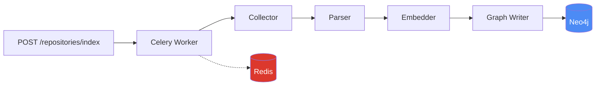
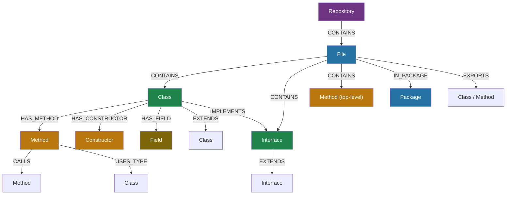
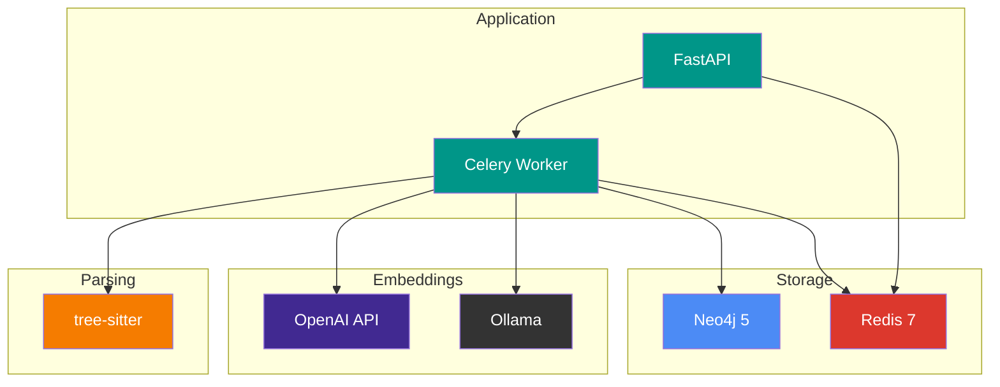

# Constellation

A code indexing engine that parses source code, generates embeddings, and builds a semantic knowledge graph in Neo4j.

Constellation is designed as a standalone data layer — it indexes codebases into a queryable graph. A separate service (e.g., an MCP server) can then query the graph for code search, impact analysis, and navigation.

## Architecture



The indexing pipeline is a four-stage process:

| Stage | Responsibility |
|-------|---------------|
| **Collector** | Discovers files, filters by extension/exclusion patterns, computes hashes for change detection |
| **Parser** | Extracts entities (classes, methods, fields) and relationships (calls, inheritance) using tree-sitter |
| **Embedder** | Generates vector embeddings for semantic search (Methods, Classes, Interfaces, Constructors) |
| **Graph Writer** | Batch upserts entities and relationships into Neo4j |

## Graph Schema



## Language Support

| Language | Extensions | Stereotype Detection |
|----------|-----------|---------------------|
| Java | `.java` | `@Test`, `@RestController`, `@Service`, `@Repository`, Spring DI |
| Python | `.py` | `test_` prefix, `@pytest`, `@api_view`, `@shared_task`, Django models, Pydantic |
| JavaScript/TypeScript | `.js` `.ts` `.jsx` `.tsx` | React hooks/context, test frameworks (`describe`/`it`/`test`) |
| C# | `.cs` | `[TestMethod]`, `[Fact]`, `[Test]`, .NET patterns |

## Quick Start

### Prerequisites

- Docker and Docker Compose
- An OpenAI API key (or a running Ollama instance)

### Setup

```bash
git clone https://github.com/sriramdingari/Constellation.git
cd Constellation
cp .env.example .env
# Set OPENAI_API_KEY in .env (or switch to ollama)
docker compose up
```

The API is available at `http://localhost:8000`.

### Index a Repository

```bash
# Index a local path
curl -X POST http://localhost:8000/repositories/index \
  -H "Content-Type: application/json" \
  -d '{"source": "/path/to/your/repo"}'

# Index from GitHub
curl -X POST http://localhost:8000/repositories/index \
  -H "Content-Type: application/json" \
  -d '{"source": "https://github.com/user/repo"}'
```

### Check Job Status

```bash
curl http://localhost:8000/jobs/{job_id}
```

### List Indexed Repositories

```bash
curl http://localhost:8000/repositories
```

## API Reference

| Method | Endpoint | Description |
|--------|----------|-------------|
| `POST` | `/repositories/index` | Trigger indexing. Returns `202 Accepted` with job ID. |
| `GET` | `/repositories` | List all indexed repositories. |
| `GET` | `/repositories/{name}` | Get details for a single repository. |
| `DELETE` | `/repositories/{name}` | Remove a repository and all its data from the graph. |
| `GET` | `/jobs/{id}` | Get job status: `queued`, `in_progress`, `completed`, `failed`. |
| `GET` | `/health` | Service health check (Neo4j + Redis connectivity). |

### POST /repositories/index

```json
{
  "source": "https://github.com/user/repo",
  "name": "my-repo",
  "exclude_patterns": ["**/test/**"],
  "reindex": false
}
```

- `source` — Local path or GitHub URL. GitHub repos are shallow-cloned, indexed, then cleaned up.
- `name` — Optional. Derived from source if omitted.
- `exclude_patterns` — Optional. Merged with built-in defaults (`node_modules`, `venv`, `__pycache__`, etc.).
- `reindex` — Skip change detection and reprocess all files.

## Configuration

All configuration is through environment variables (or a `.env` file):

```bash
# Embedding provider: "openai" or "ollama"
EMBEDDING_PROVIDER=openai
EMBEDDING_MODEL=text-embedding-3-small
EMBEDDING_DIMENSIONS=1536

# Required only for OpenAI
OPENAI_API_KEY=sk-...

# Required only for Ollama
OLLAMA_BASE_URL=http://localhost:11434

# Neo4j (defaults match docker-compose)
NEO4J_URI=bolt://localhost:7687
NEO4J_USER=neo4j
NEO4J_PASSWORD=constellation

# Redis (defaults match docker-compose)
REDIS_URL=redis://localhost:6379

# Tuning
EMBEDDING_BATCH_SIZE=8
ENTITY_BATCH_SIZE=100
```

## Stack



| Component | Role |
|-----------|------|
| **FastAPI** | REST API for triggering indexing and querying status |
| **Celery** | Background task execution with retry logic |
| **Redis** | Celery broker, job state, and per-repo concurrency locks |
| **Neo4j** | Graph database storing entities, relationships, and vector indexes |
| **tree-sitter** | Concrete syntax tree parsing for all supported languages |
| **OpenAI / Ollama** | Pluggable embedding providers for semantic vector generation |

## Project Structure

```
constellation/
├── main.py                  # FastAPI application
├── config.py                # Settings from environment variables
├── models.py                # Shared data models (CodeEntity, CodeRelationship)
├── api/
│   ├── routes.py            # API endpoints
│   └── schemas.py           # Request/response models
├── parsers/
│   ├── base.py              # BaseParser abstract class
│   ├── registry.py          # Parser registry by file extension
│   ├── python_parser.py     # Python tree-sitter parser
│   ├── java.py              # Java tree-sitter parser
│   ├── javascript.py        # JavaScript/TypeScript tree-sitter parser
│   └── dotnet.py            # C# tree-sitter parser
├── embeddings/
│   ├── base.py              # BaseEmbeddingProvider
│   ├── openai.py            # OpenAI provider
│   ├── ollama.py            # Ollama provider
│   └── factory.py           # Provider factory
├── graph/
│   ├── client.py            # Neo4j async client
│   ├── schema.py            # Node types, constraints, indexes
│   └── queries.py           # Cypher query templates
├── indexer/
│   ├── pipeline.py          # Orchestrator: collect → parse → embed → store
│   ├── collector.py         # File discovery and change detection
│   └── cloner.py            # Git clone for remote repos
└── worker/
    ├── celery_app.py         # Celery configuration
    └── tasks.py              # Index task with Redis locking
```

## Key Behaviors

- **Change detection** — Files are hashed (MD5) and compared against stored hashes in Neo4j. Only new or modified files are reprocessed. Use `reindex: true` to bypass this.
- **Concurrency control** — A Redis lock per repository prevents concurrent indexing of the same repo. Concurrent requests return `409 Conflict`.
- **Stale file cleanup** — After indexing, files present in Neo4j but absent from the filesystem are deleted along with all their contained entities.
- **Parse error isolation** — Errors in individual files never abort the pipeline. Failed files are skipped and reported in the job result.
- **Retry logic** — Celery tasks retry up to 2 times with exponential backoff on failure.
- **Clone lifecycle** — GitHub URLs are shallow-cloned to a temp directory, indexed, and cleaned up even if the pipeline fails.

## Development

### Running Tests

```bash
python -m venv .venv && source .venv/bin/activate
pip install -r requirements.txt

# Unit tests (no external services needed)
python -m pytest

# Integration tests (requires running Neo4j and Redis)
docker compose up -d neo4j redis
python -m pytest -m integration
```

### Adding a Language Parser

1. Create `constellation/parsers/your_language.py` extending `BaseParser`
2. Implement `language`, `file_extensions`, and `parse_file()`
3. Register in `constellation/parsers/registry.py`

### Adding an Embedding Provider

1. Create `constellation/embeddings/your_provider.py` extending `BaseEmbeddingProvider`
2. Implement `model_name`, `dimensions`, and `embed_batch()`
3. Register in `constellation/embeddings/factory.py`

## License

MIT
